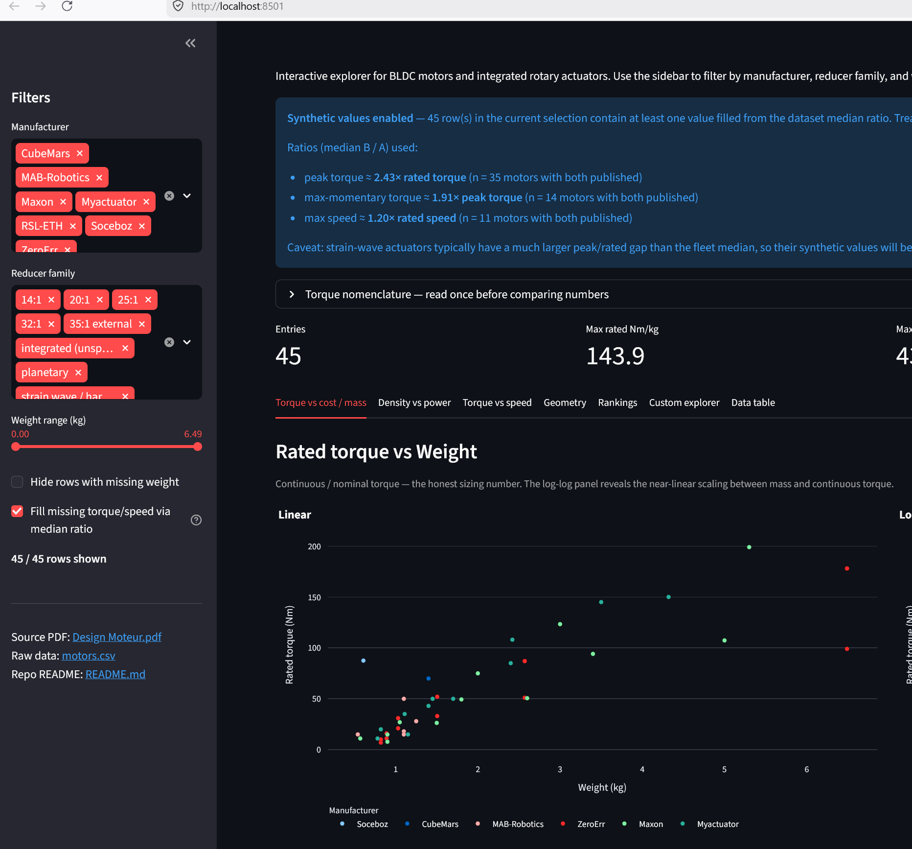

# High Torque Density Motor Review

Comparison of BLDC motors and integrated rotary actuators sourced from [Design Moteur.pdf](Design%20Moteur.pdf). Raw data is in [motors.csv](motors.csv).

## Interactive explorer (Streamlit)


The dataset is also browsable as an interactive dashboard built with Streamlit + Plotly — filter by manufacturer, reducer family and weight, then drill into torque-vs-cost, torque-vs-mass, density-vs-power, geometry, rankings and a custom X/Y scatter.

Run it locally:

```bash
pip install -r requirements.txt
streamlit run streamlit_app.py
```

Or deploy one-click to [Streamlit Community Cloud](https://streamlit.io/cloud) — point it at this repository and the entrypoint `streamlit_app.py`; no extra configuration required. Source: [streamlit_app.py](streamlit_app.py).

## Reading the torque columns

Datasheets use inconsistent wording for torque — don't compare numbers blindly.

- **Rated / Nominal torque** — the continuous torque the motor can hold indefinitely at its rated speed with a 60 °C temperature rise. This is the only number suitable for sizing against a duty cycle.
- **Peak torque** — short-duration torque for accelerations / start-stop. Some vendors (ZeroErr, Maxon HPJ DT) explicitly call this "peak torque for start and stop" or "repetitive peak". Usable for motion profiles but not continuous.
- **Max. momentary / Permissible maximum momentary torque** — emergency one-shot limit (collision, e-stop). ZeroErr lists this separately and it can be ~2x the repetitive peak. **Do not design around this value.**
- **Max torque (CubeMars AKE, some catalog summaries)** — ambiguous; usually equivalent to peak, with no continuous rating published.

Likewise, a "max speed" sometimes means no-load, sometimes rated output speed at 48 V — it is flagged in the Notes column when the distinction matters.

The Soceboz row appears twice: once as the **frameless motor alone** (its datasheet numbers) and once **after the intended 35:1 external reducer**, because the motor is shipped without a gearbox and those are not comparable to an integrated actuator.

## Comparison table

Torque density (`Nm/kg`) is computed on the actuator's published weight; rated Nm/kg uses the continuous torque and is the most honest metric for sustained applications.

| Manufacturer | Model | Reducer | V | Rated T (Nm) | Peak T (Nm) | Max Mom. T (Nm) | Rated Speed (RPM) | Max Speed (RPM) | Power (W) | Weight (kg) | Size Ø×L (mm) | Nm/kg (rated) | Nm/kg (peak) | IP | Comm. | Price (€) |
|---|---|---|---|---|---|---|---|---|---|---|---|---|---|---|---|---|
| Soceboz | FL102HSV14-48V-20530 (motor only) | none (frameless) | 48 | 2.5 | 7.5 | — | 2000 | 3100 | 523 | 0.608 | 102×23 | 4.1 | 12.3 | — | — | — |
| Soceboz | FL102HSV14 + 35:1 | 35:1 external | 48 | 87.5 | 262.5 | — | 57 | 88 | 523 | 0.608¹ | 102×23¹ | 143.9¹ | 431.7¹ | — | — | — |
| CubeMars | AKE90-8 KV35 | integrated | 48 | — | 170 | — | 120 | 210 | 1500 | 1.4 | 90×— | — | 121.4 | — | — | — |
| RSL-ETH | DynaDrive | integrated | 48 | 27 | 60 | — | 148 | — | 930 | — | — | — | — | IP66 | EtherCAT | — |
| MAB Robotics | MA-hs-h-IP66 | harmonic 50:1 | 12–48 | 28 | 60 | — | — | 90 | — | 1.25 | 102×91 | 22.4 | 48.0 | IP66 | CAN-FD / CANopen | 2 599 |
| MAB Robotics | MA-H | harmonic 50:1 | 12–48 | 15 | 32 | — | — | 66 | — | 0.54 | 73×62 | 27.8 | 59.3 | IP66 | CAN-FD / CANopen | 1 609 |
| MAB Robotics | MA-p-100-IP66 (KV60) | planetary 9:1 | 12–48 | 18 | 48 | — | — | 228 | — | 1.1 | 103×79.6 | 16.4 | 43.6 | IP66 | CAN-FD / CANopen | 1 559 |
| MAB Robotics | MA-p-100-IP66 (KV100) | planetary 9:1 | 12–48 | 15 | 38 | — | — | 421 | — | 1.1 | 103×79.6 | 13.6 | 34.5 | IP66 | CAN-FD / CANopen | 1 559 |
| MAB Robotics | MA-p-100-30 | planetary 30:1 | 12–48 | 50 | 150 | — | — | 96 | — | 1.1 | 98×67 | 45.5 | 136.4 | — | CAN-FD / CANopen | 897.56 |
| ZeroErr | eRob70i (14-50) | strain wave 50:1 | 48 | 7 | 23 | 46 | — | 60 | 100 | 0.82 | 70×71 | 8.5 | 28.0 | IP54 | EtherCAT/CANopen/Modbus | — |
| ZeroErr | eRob70i (14-100) | strain wave 100:1 | 48 | 10 | 36 | 70 | — | 30 | 100 | 0.82 | 70×71 | 12.2 | 43.9 | IP54 | EtherCAT/CANopen/Modbus | — |
| ZeroErr | eRob80f (17-50) | strain wave 50:1 | 48 | 11 | 23 | 48 | — | 60 | 126 | 0.89 | 80×57.5 | 12.4 | 25.8 | IP54 | EtherCAT/CANopen/Modbus | — |
| ZeroErr | eRob80f (17-100) | strain wave 100:1 | 48 | 16 | 37 | 71 | — | 30 | 126 | 0.89 | 80×57.5 | 18.0 | 41.6 | IP54 | EtherCAT/CANopen/Modbus | — |
| ZeroErr | eRob80i (17-50) | strain wave 50:1 | 48 | 21 | 44 | 91 | — | 60 | 126 | 1.03 | 80×64.2 | 20.4 | 42.7 | IP54 | EtherCAT/CANopen/Modbus | — |
| ZeroErr | eRob80i (17-100) | strain wave 100:1 | 48 | 31 | 70 | 143 | — | 30 | 126 | 1.03 | 80×64.2 | 30.1 | 68.0 | IP54 | EtherCAT/CANopen/Modbus | — |
| ZeroErr | eRob90i (20-50) | strain wave 50:1 | 48 | 33 | 73 | 127 | — | 60 | 314 | 1.506 | 90×75.9 | 21.9 | 48.5 | IP54 | EtherCAT/CANopen/Modbus | — |
| ZeroErr | eRob90i (20-100) | strain wave 100:1 | 48 | 52 | 107 | 191 | — | 30 | 314 | 1.506 | 90×75.9 | 34.5 | 71.1 | IP54 | EtherCAT/CANopen/Modbus | — |
| ZeroErr | eRob110i (25-50) | strain wave 50:1 | 48 | 51 | 127 | 242 | — | 60 | 723 | 2.57 | 110×80.2 | 19.8 | 49.4 | IP54 | EtherCAT/CANopen/Modbus | — |
| ZeroErr | eRob110i (25-100) | strain wave 100:1 | 48 | 87 | 204 | 369 | — | 30 | 723 | 2.57 | 110×80.2 | 33.9 | 79.4 | IP54 | EtherCAT/CANopen/Modbus | — |
| ZeroErr | eRob110i (25-160) | strain wave 160:1 | 48 | 87 | 229 | 408 | — | 18.75 | 723 | 2.57 | 110×80.2 | 33.9 | 89.1 | IP54 | EtherCAT/CANopen/Modbus | — |
| ZeroErr | eRob142i (32-50) | strain wave 50:1 | 48 | 99 | 281 | 497 | — | 40 | 1000 | 6.49 | 142×133.9 | 15.3 | 43.3 | IP54 | EtherCAT/CANopen/Modbus | — |
| ZeroErr | eRob142i (32-100) | strain wave 100:1 | 48 | 178 | 433 | 841 | — | 20 | 1000 | 6.49 | 142×133.9 | 27.4 | 66.7 | IP54 | EtherCAT/CANopen/Modbus | — |
| ZeroErr | eRob142i (32-160) | strain wave 160:1 | 48 | 178 | 484 | 892 | — | 12.5 | 1000 | 6.49 | 142×133.9 | 27.4 | 74.6 | IP54 | EtherCAT/CANopen/Modbus | — |
| Maxon | HEJ 50 | integrated | 20–60 | 11 | 30 | — | — | ~200 (21 rad/s) | — | 0.57 | — | 19.3 | 52.6 | — | EtherCAT | — |
| Maxon | HEJ 70 | integrated | 20–60 | 27 | 62 | — | — | ~172 (18 rad/s) | — | 1.05 | — | 25.7 | 59.0 | — | EtherCAT | — |
| Maxon | HEJ 90 | integrated | 20–60 | 75 | 140 | — | — | ~96 (10 rad/s) | — | 2.00 | — | 37.5 | 70.0 | — | EtherCAT | — |
| Maxon | HEJ Hercules (dev) | integrated | 20–60 | — | ~250–300 | — | — | ~96 (~10 rad/s) | — | <3 | — | — | ~100 | — | EtherCAT | — |
| Maxon | HPJ DT38S-WGA14 | 14:1 | — | — | 12–19² | — | — | 85–170 (8.9–17.8 rad/s) | — | 0.9 | 74×73 | — | 14–21 | — | — | — |
| Maxon | HPJ DT38M-WGU14 | 14:1 | — | — | 23–36² | — | — | 65–130 (6.8–13.6 rad/s) | — | 0.9 | 74×83 | — | 26–40 | — | — | — |
| Maxon | HPJ DT50S-WGA20 | 20:1 | — | — | 39–64² | — | — | 32–106 (3.4–11.1 rad/s) | — | 1.5 | 94×78 | — | 26–43 | — | — | — |
| Maxon | HPJ DT50M-WGU20 | 20:1 | — | — | 73–120² | — | — | 22–69 (2.3–7.2 rad/s) | — | 1.8 | 94×86 | — | 41–67 | — | — | — |
| Maxon | HPJ DT65S-WGA25 | 25:1 | — | — | 69–123² | — | — | 23–73 (2.4–7.6 rad/s) | — | 2.6 | 114×90 | — | 27–47 | — | — | — |
| Maxon | HPJ DT65M-WGU25 | 25:1 | — | — | 127–229² | — | — | 12–41 (1.3–4.3 rad/s) | — | 3.4 | 114×100 | — | 37–67 | — | — | — |
| Maxon | HPJ DT85M-WGA32 | 32:1 | — | — | 151–261² | — | — | 16–51 (1.7–5.3 rad/s) | — | 5.0 | 146×107 | — | 30–52 | — | — | — |
| Maxon | HPJ DT85L-WGU32 | 32:1 | — | — | 281–484² | — | — | 9–29 (0.9–3.0 rad/s) | — | 5.3 | 146×120 | — | 53–91 | — | — | — |
| MyActuator | RMD-X6-P20-60-E | planetary 19.6:1 | 48 | 20 | 60 | — | 153 | 176 | 320 | 0.82 | — | 24.4 | 73.2 | — | EtherCAT / CAN | — |
| MyActuator | RMD-X8-P20-120-E | planetary 19.6:1 | 48 | 43 | 120 | — | 127 | 158 | 574 | 1.40 | — | 30.7 | 85.7 | — | EtherCAT / CAN | — |
| MyActuator | RMD-X12-P20-320-E | planetary 20:1 | 48 | 85 | 320 | — | 100 | 125 | 1000 | 2.40 | — | 35.4 | 133.3 | — | RS485 / EtherCAT / CAN | — |
| MyActuator | RMD-X15-P20-450-E | planetary 20.25:1 | **72** | 145 | 450 | — | 98 | 108 | 1480 | 3.50 | — | 41.4 | 128.6 | — | RS485 / EtherCAT / CAN | — |
| MyActuator | RMD-X10-P7-40-R-N | planetary 7:1 | 48 | 15 | 40 | — | 165 | — | 265 | 1.15 | ~106×— | 13.0 | 34.8 | — | CAN / RS485 | — |
| MyActuator | RMD-X10-P35-100-R-N | planetary 35:1 | 48 | 50 | 100 | — | 50 | — | 265 | 1.70 | ~106×— | 29.4 | 58.8 | — | CAN / RS485 | — |
| MyActuator | EPS-RH-32-100-E-N-D | harmonic 100:1 | 48 | 150 | 229 | — | 18 | 20 | 282 | 4.32³ | — | 34.7 | 53.0 | — | EtherCAT / CAN | — |
| MyActuator | EPS-RH-25-100-E-N-D | harmonic 100:1 | 48 | 108 | 157 | — | 25 | 30 | 282 | 2.42³ | — | 44.6 | 64.9 | — | EtherCAT / CAN | — |
| MyActuator | EPS-RH-20-100-E-N-D | harmonic 100:1 | 48 | 50 | 80 | — | 25 | 30 | 130 | 1.45³ | — | 34.5 | 55.2 | — | EtherCAT / CAN | — |
| MyActuator | EPS-RH-17-100-E-N-D | harmonic 100:1 | 48 | 35 | 54 | — | 25 | 30 | 91 | 1.11³ | — | 31.5 | 48.6 | — | EtherCAT / CAN | — |
| MyActuator | EPS-RH-14-100-E-N-D | harmonic 100:1 | 48 | 11 | 28 | — | 25 | 30 | 28 | 0.78 | — | 14.1 | 35.9 | — | EtherCAT / CAN | — |

¹ Soceboz frameless stator alone; reducer mass and housing not included — Nm/kg figures are therefore optimistic and **not** comparable to the integrated-actuator rows.
² Maxon HPJ DT "Peak Joint Torque, Repetitive". The range reflects different gear-ratio sub-variants within the same body, not rated-vs-peak.
³ MyActuator EPS-RH weights listed without brake; add-brake version is ~0.3–0.4 kg heavier (32 → 4.74, 25 → 2.74, 20 → 1.75, 17 → 1.28 kg).

## Highest rated torque density (Nm per kg, continuous)

1. MAB MA-p-100-30 — **45.5** Nm/kg (50 Nm cont., 1.1 kg, planetary 30:1)
2. MyActuator EPS-RH-25-100 — **44.6** (108 Nm, 2.42 kg, harmonic 100:1)
3. MyActuator RMD-X15-P20-450 — **41.4** (145 Nm, 3.50 kg, 72 V)
4. Maxon HEJ 90 — **37.5** (75 Nm, 2.00 kg)
5. MyActuator RMD-X12-P20-320 — **35.4** (85 Nm, 2.40 kg)

AKE90-8 and the HPJ-DT series publish only peak torque, so they cannot be ranked on continuous density; CubeMars AKE90-8 in particular advertises 170 Nm max but no continuous figure and would almost certainly drop sharply on that chart.

## Sources

- Soceboz FL102HSV series : guesstimate
- CubeMars — <https://www.cubemars.com/fr>
- RSL ETH DynaDrive — <https://rsl.ethz.ch/robots-media/actuators/DynaDrives.html>
- MAB Robotics — <https://www.mabrobotics.pl/product-page/ma-h>
- ZeroErr eRob — <https://en.zeroerr.cn/rotary_actuators>
- Maxon HEJ / HPJ-DT — <https://global.maxongroup.com/high-efficiency-joints>
- MyActuator — <https://www.myactuator.com/product>
