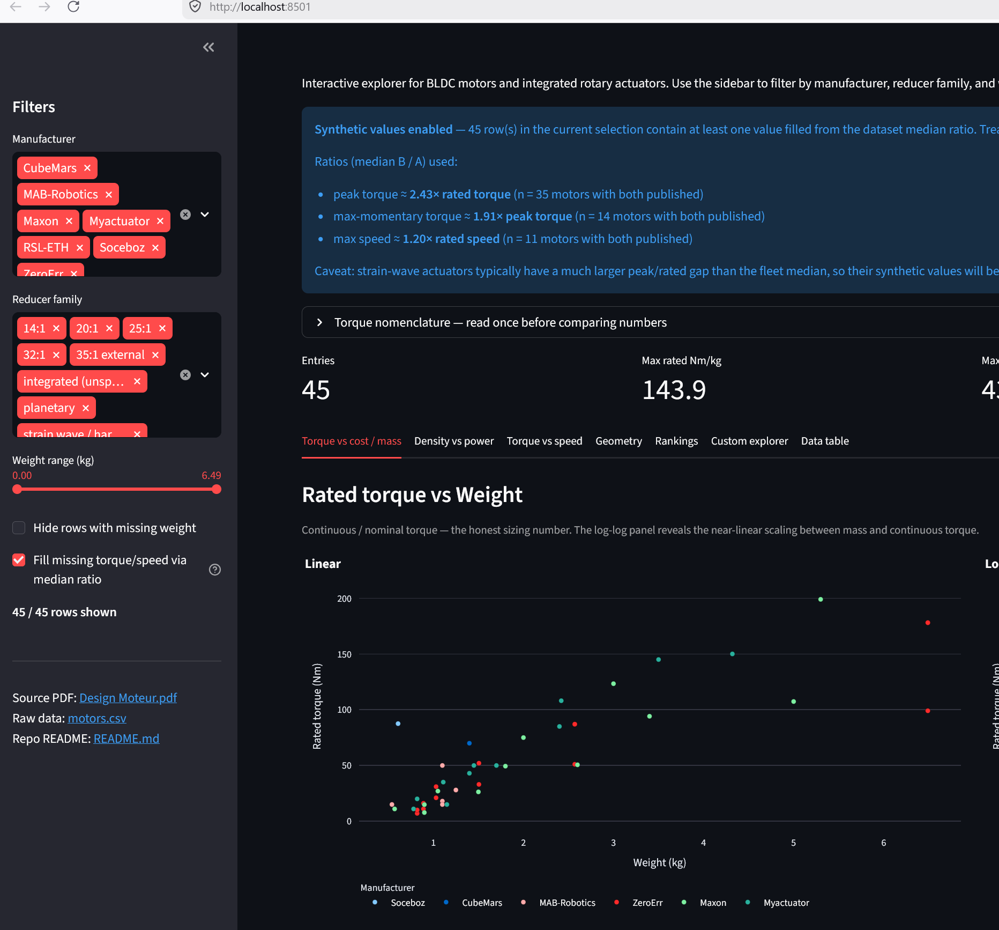

# High Torque Density Motor Review

A component-layered database and interactive explorer for BLDC **motors**,
**gearboxes**, **drivers**, and integrated **actuators** plus a **builder** that
composes a motor × gearbox × driver and benchmarks the result against commercial
actuators.

## Interactive explorer (Streamlit)


it is accessible here : [streamlit dashboard](https://motormap.streamlit.app/)

If you want to run it locally :

```bash
pip install -r requirements.txt
streamlit run streamlit_app.py
```

## Methodology
All the company I could find that sell robotics actuator where scrapped.
The datasheet of each actuator was then parsed unsing an LLM and added to the CSV.

| Manufacturer | Actuator count |
|---|---|
| ZeroErr | 32 |
| MyActuator | 29 |
| CubeMars | 22 |
| SteadyWin | 21 |
| Maxon | 12 |
| MAB Robotics | 8 |
| RobStride | 7 |
| HEBI Robotics | 6 |
| Soceboz | 1 |
| RSL-ETH | 1 |
| mjbots | 1 |
| **Total** | **140** |

The modeling follows *"How to Model Brushless Electric Motors for the Design of
Lightweight Robotic Systems"* (Lee et al., [arXiv:2310.00080](https://arxiv.org/abs/2310.00080),
local copy [ModelBLDC.pdf](ModelBLDC.pdf)).

for more information, read [IMPLEMENTATION.md](IMPLEMENTATION.md)